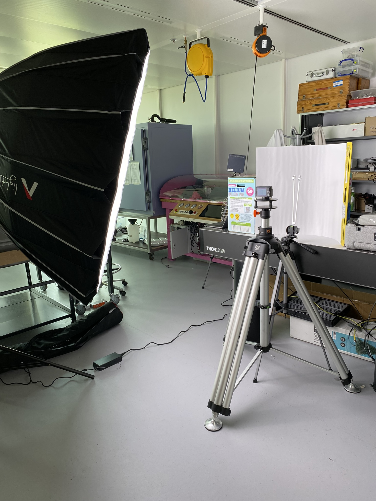

# Introduction
This repo contains all the information needed to reproduce the experiments done in the paper *A Novice Video Vibration Analysis framework with Motion Magnification: Pipeline for Reproducible Evaluation*.

<!-- TODO: check paper name at the end -->

Before you start make sure you have all of the [Dependencies](#Dependencies) installed first. For an overview of the repo please refer to the [Structure](#Structure) chapter. 

The rest of the repo is separated into two sections, [Data Collection](#data-collection) and [Data Processing](#data-processing) respectively. The Data Processing process relies on the data of the Data collection process. For more information please refer to the individual chapters.

- [Data Collection](#data-collection)
- [Data Processing](#data-processing)

***The Pipeline***
<!-- Might need a update -->


## Dependencies
Before you start, you will have to install these dependencies

- FFmpeg should be installed on the system
- Cuda enabled system
- Python 3.11
    - for packages see requirements.txt


## Structure
Below is an overview of all the files and folders within the repo

- resources (data)
    - input (input videos)
    - processed (pre processed videos)
    - magnified (magnified videos)
    - merged (compare videos)
    - temp (used by STB-VMM)
- src (code)
    - utils.py (helper methods)
    - expirimentDataManager.py (get data for main.py loop)
    - preprocessing.py (preprocess loop)
    - MotionMagnificaitonManager.py (handels the MM loop)
    - MotionMagnification (contains the MM methods)
        - WUEB-VMM
        - LB-VMM
        - STB-VMM
    - PostProcessing.py (for now makes just merges videos)
    - Evaluate.py (contains the evaluation process) 

main.py (entry point for the code)
README.md (you are here)

## Run

execute the [main.py](main.py) in the terminal to start the process. Look at the [main.py](main.py) file if you want to see how it works.

As of now it does not contain any args but there are variables you can change in the file. 

# Data Collection
This chapter contains information on how the data for the paper has been collected. First, we will describe the [Video Collection Setup](#video-collection-setup) used to collect the data after which the [experiments](#experiment-setups) are outlined. 

## Video Collection Setup
The Video Collection Setup is the most important part of the process since the quality of video data determines the quality of the magnified videos and eventual video vibration analysis.

First, we will go over the advised [Workflow](#workflow). Keeping track of the data you collect, the parameters of the setup, and other information related to the experiments is something you will thank yourself for later. After this, we will go over the two Video Collection setups [VCS1](#vcs1) and [VCS2](#vcs2). The goal is to inform on what we have used and it can be used as an example for creating your setup.

### Workflow & Video Capture plan
Before you start with the Video Collection Process, it is advised that you make a Video Capture Plan. In this chapter, we will go over how you could make this and what to take into account. The following questions could help guide you to make a plan:

<!-- TODO: review these questionns, extend on them, put in appendix if paper -->

- What is the goal of your experiment?
- What kind of video shots do you need for this goal?
    - What object is important?
    - What kind of input do you need for your models? 
- Do you know the natural frequency (Hz) of the object you are filming?
    - for FFT you need Hz*2 as FPS for the camera
    - for MM it is advised to have Hz*2.5x/10x as FPS for the camera
- In what environment are you planning to film?
    - Think about lighting
    - environmental vibration
    - assessability

Use these questions and other information about your experiment to create a list of videos you want to collect. This is an example of what we used:

Here's the adjusted table converted into Markdown format:

| runid | video | vorktype | metlego | fps | iso | sluitertijd | diafragma | lamp kleur | lamp intensiteit | statief angle        |
|-------|-------|----------|---------|-----|-----|-------------|-----------|------------|------------------|----------------------|
| 1     | 43    | 128hz    | ja      | 1000| 1250| 2000        | 1.8       | cct 7500k   | 100%             | 1 poot verder uit    |
| 2     | 44    | 64hz     | ja      | 1000| 1250| 2000        | 1.8       | cct 7500k   | 100%             | 1 poot verder uit    |
| 3     | 45    | 32hz     | ja      | 1000| 1250| 2000        | 1.8       | cct 7500k   | 100%             | 1 poot verder uit    |
| 4     | 47    | 128hz    | ja      | 500 | 650 | 1000        | 1.8       | cct 7500k   | 100%             | 1 poot verder uit    |
| 5     | 49    | 64hz     | ja      | 500 | 650 | 1000        | 1.8       | cct 7500k   | 100%             | 1 poot verder uit    |
| 6     | 48    | 32hz     | ja      | 500 | 650 | 1000        | 1.8       | cct 7500k   | 100%             | 1 poot verder uit    |
| 7     | 51    | 128hz    | ja      | 250 | 320 | 500         | 1.8       | cct 7500k   | 100%             | 1 poot verder uit    |
| 8     | 52    | 64hz     | ja      | 250 | 320 | 500         | 1.8       | cct 7500k   | 100%             | 1 poot verder uit    |
| 9     | 53    | 32hz     | ja      | 250 | 320 | 500         | 1.8       | cct 7500k   | 100%             | 1 poot verder uit    |
| 10    | 56    | 128hz    | nee     | 1000| 1000| 2000        | 1.8       | cct 7500k   | 100%             | vlak                 |
| 11    | 57    | 64hz     | nee     | 1000| 1000| 2000        | 1.8       | cct 7500k   | 100%             | vlak                 |
| 12    | 58    | 32hz     | nee     | 1000| 1000| 2000        | 1.8       | cct 7500k   | 100%             | vlak                 |
| 13    | 59    | 128hz    | nee     | 500 | 500 | 1000        | 1.8       | cct 7500k   | 100%             | vlak                 |
| 14    | 60    | 64hz     | nee     | 500 | 500 | 1000        | 1.8       | cct 7500k   | 100%             | vlak                 |
| 15    | 61    | 32hz     | nee     | 500 | 500 | 1000        | 1.8       | cct 7500k   | 100%             | vlak                 |
| 16    | 63    | 128hz    | nee     | 250 | 250 | 500         | 1.8       | cct 7500k   | 100%             | vlak                 |
| 17    | 64    | 64hz     | nee     | 250 | 250 | 500         | 1.8       | cct 7500k   | 100%             | vlak                 |
| 18    | 65    | 32hz     | nee     | 250 | 250 | 500         | 1.8       | cct 7500k   | 100%             | vlak                 |


Some information is filled in before filming and other information is added after filming. For instance, the video column contains the number of the video file while the metlego column tracks if a certain object should be in the video.

Now that you have an overview of which videos you want to make, it is time to setup the video capture setup of your choice including the scene you want to film. It is advised that you make some test shots and tweak the camera settings/angle to make sure that it fits your needs.

After this, it is time to make the shots, make sure you keep track of the info in your sheet.

When you are done filming, check the videos on a bigger screen as well to make sure that they meet your requirements. If it is not to your liking you can still redo them when the setup is ready to use. Otherwise, you can now continue with the [Data Processing](#data-processing) section.

### VCS1
For the initial exploration of Motion Magnification, we used a simplistic setup with an iPhone camera and an entry-level tripod. The slo-mo function of the iPhone allows to capture up to 240fps, which should theoretically allow for Motion Magnification at lower frequencies.

#### Parts
| Name | Description |
|-------|-------|
| tripod:  Cullmann Alpha 2500 |  | 
| Mount: Cullmann Cross Cx141 1/4”v | | 
| Camera: Iphone 11 Pro|  
| Camera Settings |  memory: onboard, battery onboard, fps: 60/240, zoom: 0.5/1/2, Iso: automatic, aperture: automatic, shutter speed: automatic |
| Lighting | None |

### VCS2
During the testing phase with the [VCS1](#vcs1) setup, we ran into some challenges. this new setup should tackle most of these challenges. Some improvements are:
- up to 1000fps snapshots (~3sec long).
- better camera control settings (FPS, zoom, ISO, aperture, shutterspeed).
- New tripod which should negate most of the environmental vibration.
- lighting setup to ensure better light conditions.

#### Parts
| Name | Description |
|-------|-------|
| Tripod:  MQH175h60-1 with bag|  | 
| Tripod addons | Level : mqh232, Carry bag: mqh234, Extra padding on feet. |
| Mounts normal |   3 versions with thread size: 1,4", 3/8", 5/8"|
| Mounts anti vibration |  3 versions with thread size: 1,4", 3/8", 5/8"|
| Camera: Sony Zv1 | | 
| Camera settings: |FPS 30/60/250/500/1000, Zoom: Variable, Iso:Manual, Aperture:manual, shutter speed: manual |
| Camera addons|  2x 128 sd u3 v60, sd reader, battery x5, battery charger, |
| Lights 2x in case|  |
| Light tripod 2x| |
| Softbox light dome 2x with bag| |
| Softbox lantern 2x with bag| |
| light battary bay 2x | soontm|
| mini v mount battary 4x| |


#### Extra Info
##### HFR (High Frame Rate)
Slow-motion / HFR (High Frame Rate) video recording is possible up to 960/1000fps (NTSC/PAL), with 480/500fps, and 240/250fps options. The higher the frame rate, the lower the actual resolution recorded, with 240/250fps recording at a resolution of 1824x1026, 480/500fps recording at a resolution of 1824x616, and 960/1000fps recording at 1244x420 (on the quality priority setting). All of these are then enlarged to 1920x1080 (FullHD) resolution.

##### useful links
https://giggster.com/guide/review/sony-zv-1-review-34864
https://helpguide.sony.net/dc/1910/v1/en/contents/TP0002867845.html
https://www.movavi.com/learning-portal/ntsc-vs-pal-which-is-better.html

## Experiment Setups 
In this subchapter, you can find the setups for the experiments.

### Tuning setup (LAB)
Extracting the natural frequency of an object in a video is one of the goals we have with the VCS. To tune, calibrate and validate the setup, we have created the tuning setup.

For the tuning setup we use the following components:

| Name | Description |
|-------|-------|
| Tuning forks: |   |
| tuning fork mount |  |
| Tripod |  |

For our tests we have used [VCS2](#vcs2). See the images blow for the final setup

| Name | Description |
|-------|-------|
| angle 1 | angle 2 |
|  | |


### Controlled installation (LAB)


| Name | Description |
|-------|-------|
| angle 1 | angle 2 |
|  | |


<!-- ### TODO: Cooler Setup -->

# Data Processing
This chapter contains information on the Data Processing process used in the paper. It assumes data from the Data Collection process is used. The following major steps are included:

- [x] [Preparation](#preparation)
- [x] [preprocessing](#preprocessing)    
- [x] [Motion Magnification](#motion-magnification)
- [x] [PostProcessing](#postprocessing)
- [x] [Evaluation](#evaluation)

## Preparation

- [x] Input Preparation
- [x] ROI selection
- [x] Backup-original

### Input Preparation
For this setup, we assume that data is available as per the requirements of the [collection process](#data-collection). In this step, we will organize the video data in such a way that future processing will be as easy as possible and we won't lose track of which video is what. 

The [resources/input folder](resources/input) will be used for the input preparation. Please follow the steps below to prepare the input.

***Use simple and if possible short names, without special characters and/or spaces***

0. If your video files are large, you can use the command below to compress them.
    1. change r to the framerate of the video
    2. change the scale to the desired scale

```bash
for i in *.MP4; do ffmpeg -y -r 50 -i  "$i" -c:v libx264 -profile:v high -vf scale=-640:420 -preset slow -crf 23 -an "${i%.*}_compressed.mp4"; done
```

If you are working with videos that have a different framerate, which can be checked with ffprobe "filename", you might want to make the framerates of the video the same. We made every video 50 fps. The video is playback speed not recording speed.

```bash
ffmpeg -y -r 50 -i IMG_5192.MOV -an IMG_5192_50.MOV
```

1. Within the [resources/input folder](resources/input) create a folder with the name of the experiment of which the videos are.
2. Within this folder create subfolders for the different angles/perspectives used
3. If you want to differentiate further, you can nest even more folders. (for instance, if you want to differentiate for zoom level or light level). You can use the [Video Capture Plan](#workflow--video-capture-plan) to guide you.
4. Put the videos in their assigned folders.
5. If you want to add information about the experiment, add a readme file (or something similar) in the root folder of the experiment.
    5.1. If you have collected any other data you can also add this in the relevant (sub)folder.


> You should end up with something like this:
> - resources
>   - input
>       - tuning
>           - tuning_experiment.md
>           - temp-measure.csv
>           - overview
>               - light-100
>                   - displacement.csv
>               - light-0
>           - zoom-top
>               - light-100
>                   - displacement.csv
>               - light-0
>           - zoom-bottom
>               - light-100
>                   - displacement.csv
>               - light-0


<!-- TODO: check where this nameing and folder structure fits -->
<!-- A run's execution, results in a video and related data. This video is manipulated and used to extract metrics. It is essential that videos are not accidentally confused with each other and that the related data is associated with the right video. A naming convention and folder structure have been designed to aid the organisation of data during all of the data processing done in this research.

The initial organisation involves a folder structure (Table~\ref{table:folderstructure}) that segregates the data of various process stages. This setup enables the code to exclusively utilise data from the relevant process stage while offering a convenient way for researchers to locate the information they need promptly. The input folder is the sole directory that is manually populated, while the remaining folders are automatically populated with results from different process steps. A step-by-step guide on how the input folder should be organised, including examples, can be found in Appendix \ref{Appendix:i}. 

The organisation's second component is the naming convention utilised. When arranging the folders, the video names do not require modification. The initial stage of the automated process involves extracting metadata from the folder structure and videos to produce a new filename automatically. The name's prefix consists of the folder names in which it resides, separated by an underscore. The filename suffix includes the video frame rate, video resolution, and file extension. This approach provides all the necessary information on the spot. If needed, we can consult the newly created JSON file alongside the video file with the same name to access more detailed metadata information about the original video.

During the execution of our methods, new video files and accompanying data are generated. To maintain the link to the initial video, we have opted to consistently include the complete name of the original video and subsequently append an additional suffix for any newly created files. This process is reiterated if new files are generated based on these. Please refer to Appendix \ref{Appendix:i} for a comprehensive overview of the various segments utilised in our naming conventions. -->


### RoI selection
Next, the RoI can be selected using the RoI\_select.py script. The script requires the name of the experiment via the -en parameter, and the data should be available in the process folder. When the script is executed, a window will display a frame of the video. By clicking and dragging, a bounding box can be created to define the RoI. Pressing enter after selecting a region, and repeating this process for each video frame, will establish the RoI for each video. 

> python3 RoI_select <experiment_name>

*** Keep in mind that the selection tool can be a bit slow. click wait for a moment and then drag to ensure a good selection ***

*** It is a good practice to select an area that is slightly larger than the subject if possible. This allows for a greater chance to find features to track ***

<!-- # Set up parameters for ShiTomasi corner detection
# Set up parameters for Lucas-Kanade optical flow -->

### Backup Original
After Organizing it is advised that you make a backup since data may be lost or corrupted during the rest of the steps. We use a compression tool to create a zip, rar, etc and rename it to the experiment and the data. This zip is stored on our working device and a separate SSD.

> This setup is optional. However, since recollection the data will probably take a lot of time or is sometime not possible... please create a backup for your own sanity. 

## PreProcessing

- [x] Meta-Data extraction
- [x] Renaming
- [x] Strip Audio
- [x] Lower resolution and optimize resolution

### Meta-Data Extraction
For further processing steps, we will need more information about the videos. to extract this data we will use FFprobe, which is included with the installation of FFmpeg. The Meta-data will be used as part of the naming convention and be saved in a separate JSON file.

The data will be extracted with the following command:
```bash 
ffprobe -v quiet -print_format json -show_format -show_streams "filename.mp4" > "filename.mp4.json"
```

### Renaming
You should now have an organized folder structure and know how we can extract meta-data from the video files. We will now use this folder structure and the meta-data to rename our files. At the end of the process, we will have a lot of different versions of the same file. This renaming and naming convention will help us to keep a good overview.

The files will be renamed as follows:
>Experimentfoldername_subfolder_othersubfolders_fps_resolution.extension

note that:
- The json file will get the same name
- The video will go through different processing steps. these steps will create a new file and adjust the file name accordingly. 


### Strip Audio
For our use-case we do not need audio data. The following snippet is used to remove the audio from the video:

```bash
ffmpeg -i filename.mp4 -c copy -an filename-an.mp4
```

*For efficiency this step is merged with the next one*

### Adjust resolution, minimize quality loss
For our application, we prefer a lower-resolution video. To achieve this we execute the following code snippet:

<!-- https://img.ly/blog/ultimate-guide-to-ffmpeg/
h.264 codec (yuv420p) -->

```bash
ffmpeg -y -r {fps} -i {root}/{filename_new} -c:v libx264 -profile:v high -vf scale={W}:{H} -preset slow -crf 23 -an {filename_processed}'
```

Arguments Explained:

| Option          | Description                                             |
|-----------------|---------------------------------------------------------|
| `-y`            | Overwrite if file exists                                |
| `-r`            | Set framerate                                           |
| `-i`            | Input filename                                          |
| `-c:v`          | Select codec used                                       |
| `-profile:v`    | Settings for codec                                      |
| `-vf scale=-1:720` | Resize video to this resolution (-1 ensures aspect ratio) |
| `-preset`       | Speed vs quality of encoding                            |
| `-crf`          | Compression factor (lower number == higher quality)     |
| `-an`           | Remove audio (audio no)                                 |
| Last argument   | Output filename                                         |

## Motion Magnification

- [x] overview
- [x] WUEB-VMM
- [x] LB-VMM
- [x] STB-VMM
- [x] add skip for if processed
- [x] do for selected Amplification factors 

### Overview
During the Motion Magnification step, the pipeline will process every video with the selected settings. With the default settings, one input file will generate 9 output files. If you want to change the output please take a look at main.py.

In the next chapters, you will find the code for if you want to execute a magnification manually. 

Before the pipeline starts processing, it will check if the output already exists. If it does it will skip the file.

### WUEB-VMM

```python

entrypoint = 'src/MotionMagnification/WUEB-VMM/evm.py'
input_location = 'resources/processed/hz128test/normal/hz128test_normal_50-1_640x420.mp4'
MF = 10
output_location = 'resources/magnified/hz128test/normal/hz128test_normal_50-1_640x420_test.mp4'

mode = 'laplacian' # this is the motion option
lc = 16 # spatial frequency cutoff
lo = 0.4 # frequency cutoff low
ho= 24  # frequency cutoff high     

Popen(f'python3 {entrypoint} -v={input_location} -a{MF} \
    -s{output_location} -m={mode} --lambda_cutoff={lc} \
    --low_omega={lo} --high_omega={ho} ', shell=True).wait() 

```

> depending on the application you might want to adjust the lc, oc and ho variables

### LB-VMM

```python

entrypoint = 'src/MotionMagnification/LB-VMM/main.py'
method = 'amplify'
checkpoint = 'src/MotionMagnification/LB-VMM/20191204-b4-r0.1-lr0.0001-05.pt'    
input_location = 'resources/processed/hz128test/normal/hz128test_normal_50-1_640x420.mp4'
MF = 10
output_location = 'resources/magnified/hz128test/normal/hz128test_normal_50-1_640x420_test.mp4'   

Popen(f'python3 {entrypoint} {method} {checkpoint} \
              {input_location} {output_location} --amplification={MF}',
                shell=True).wait()     
```

### STB-VMM 
```python

entrypoint = 'src/MotionMagnification/STB-VMM/magnify_video.sh'
checkpoint = 'src/MotionMagnification/STB-VMM/ckpt/ckpt_e49.pth.tar'
o = 'thisisoverhead'
s = 'resources/temp/'
fps = 50 
input_location = 'resources/processed/hz128test/normal/hz128test_normal_50-1_640x420.mp4'
MF = 10
output_location = 'resources/magnified/hz128test/normal/hz128test_normal_50-1_640x420_test.mp4'   

Popen(f'bash {entrypoint} -mag {MF} -i {input_location} \
        -m {checkpoint} -o {o} -s {s} -f {fps} -ol {output_location} -c',
        shell=True).wait()

```

## PostProcessing

- [x] 2x2 video grid
    - [x] normal and all magnifications factor of 1 method
    - [x] same magnification factor of all methods
    - [x] add check for if already done for both above and if yes skip
- [x] FFT graph
- [x] frequency table

### 2x2 video grid
The code below will make a 2x2 video grid to help with human evaluation. This is done in the postprocessing of the pipeline by default for all magnification factors of one method (original + up to three) and all methods of one magnification factor (original + up to three).

```Python

from subprocess import Popen

fps = 50

resolutie = [640,420]

input_original = 'resources/processed/hz128test/normal/hz128test_normal_50-1_640x420.mp4'
text_original = '50FPS_640x420_original'

input_m1 = 'resources/magnified/hz128test/normal/hz128test_normal_50-1_640x420_wueb@3.mp4'
text_1 = '50FPS_640x420_WUEB@3'

input_m2 = 'resources/magnified/hz128test/normal/hz128test_normal_50-1_640x420_wueb@5.mp4'
text_2 = '50FPS_640x420_WUEB@5'

input_m3 = 'resources/magnified/hz128test/normal/hz128test_normal_50-1_640x420_wueb@10.mp4'
text_3 = '50FPS_640x420_WUEB@10'

output = 'resources/merged/hz128test/normal/hz128test_normal_50-1_640x420_wueb@ALL_test.mp4'


Popen(f'ffmpeg -r {fps} \
                -i {input_original} -i {input_m1} -i {input_m2} -i {input_m3}\
                -filter_complex \
                    "[0:v] setpts=PTS-STARTPTS, scale={resolutie[0]}:{resolutie[1]}, drawtext=text=Original:fontsize=20:x=30:y=30:fontcolor=white:box=1:boxcolor=black@0.5:boxborderw=5 [a0];\
                    [1:v] setpts=PTS-STARTPTS, scale={resolutie[0]}:{resolutie[1]}, drawtext=text={text_1}:fontsize=20:x=30:y=30:fontcolor=white:box=1:boxcolor=black@0.5:boxborderw=5 [a1];\
                    [2:v] setpts=PTS-STARTPTS, scale={resolutie[0]}:{resolutie[1]}, drawtext=text={text_2}:fontsize=20:x=30:y=30:fontcolor=white:box=1:boxcolor=black@0.5:boxborderw=5 [a2];\
                    [3:v] setpts=PTS-STARTPTS, scale={resolutie[0]}:{resolutie[1]}, drawtext=text={text_3}:fontsize=20:x=30:y=30:fontcolor=white:box=1:boxcolor=black@0.5:boxborderw=5 [a3];\
                    [a0][a1][a2][a3] xstack=inputs=4:layout=0_0|w0_0|0_h0|w0_h0[v]"\
                -map "[v]" {output}', shell=True).wait()
                

```


## Evaluation Output
When the process is done, the files will all be gathered in the output folder. 

The files included for every input video are:

- [x] Original video
- [x] Original video metadata
- [x] Region of intrest (RoI) for video
- [x] Compressed video
- [x] Magnified versions of compressed video based on selection
    - by default 3, 5, and 10 factor
    - by default WUEB, LB, and STB method
    - for a total of 9 videos
- [x] a 2x2 grid of original video 3, 5, 10 @ of one method
    - by default a total of 3 grids
- [x] a 2x2 grid of original video with one magnification factor for every method
    - by default a total of 3 grids
- [x] for every video mentioned
    - [x] x and y displacement data of feature within RoI
        - [x] raw data and graph
        - [x] max and min of both x and y
    - [x] FFT created for this displacement 
        - [x] raw data and graph
        - [x] top 10 frequencies with the highest amplitude
- [x] ctrl displacement measurement (with sensor) to compare
    - [x] FFT created for this displacement 
        - [x] raw data and graph
        - [x] top 10 frequencies with the highest amplitude
- [x] human evaluation has to be done manually
